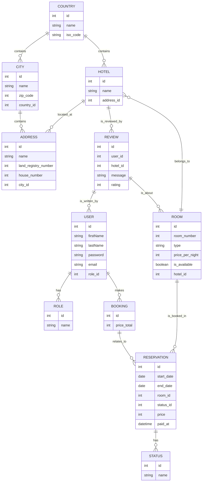

# Data Model

The data model for the Hotel Reservation System is designed to capture the various entities and their relationships. Below is a visual representation of the data model using Mermaid, followed by a detailed description of each entity.

## Data Model Diagram

## Entity Descriptions

### User

| Field        | Type      | Description                             |
|--------------|-----------|-----------------------------------------|
| `id`         | int       | Unique identifier for the user.        |
| `firstName`  | string    | User's first name.                     |
| `lastName`   | string    | User's last name.                      |
| `password`   | string    | Hashed password for authentication.     |
| `email`      | string    | Unique email address for the user.     |
| `role_id`    | int       | Foreign key linking to the user's role. |

### Role

| Field        | Type      | Description                             |
|--------------|-----------|-----------------------------------------|
| `id`         | int       | Unique identifier for the role.        |
| `name`       | string    | Name of the role (e.g., Admin, Customer). |

### Booking

| Field        | Type      | Description                             |
|--------------|-----------|-----------------------------------------|
| `id`         | int       | Unique identifier for the booking.     |
| `price_total`| int      | Total price for the booking.           |

### Status

| Field        | Type      | Description                             |
|--------------|-----------|-----------------------------------------|
| `id`         | int       | Unique identifier for the status.      |
| `name`       | string    | Name of the status (e.g., Pending, Confirmed). |

### Hotel

| Field        | Type      | Description                             |
|--------------|-----------|-----------------------------------------|
| `id`         | int       | Unique identifier for the hotel.       |
| `name`       | string    | Name of the hotel.                     |
| `country_id` | int      | Foreign key linking to the country where the hotel is located. |

### Address

| Field                   | Type      | Description                                                       |
|-------------------------|-----------|-------------------------------------------------------------------|
| `id`                    | int       | Unique identifier for the address.                               |
| `name`                  | string    | Name of the address.                                             |
| `land_registry_number`  | int       | Land registry number associated with the address.               |
| `house_number`          | int       | House number of the address.                                    |
| `city_id`               | int       | Foreign key linking to the city.                                |

### City

| Field        | Type      | Description                             |
|--------------|-----------|-----------------------------------------|
| `id`         | int       | Unique identifier for the city.        |
| `name`       | string    | Name of the city.                      |
| `zip_code`   | int       | Postal code for the city.              |
| `country_id` | int       | Foreign key linking to the country.    |

### Country

| Field        | Type      | Description                             |
|--------------|-----------|-----------------------------------------|
| `id`         | int       | Unique identifier for the country.     |
| `name`       | string    | Name of the country.                   |
| `iso_code`   | string    | ISO code for the country.              |

### Room

| Field            | Type      | Description                                   |
|------------------|-----------|-----------------------------------------------|
| `id`             | int       | Unique identifier for the room.              |
| `room_number`    | int       | Number assigned to the room.                 |
| `type`           | string    | Type of room (e.g., Single, Double).        |
| `price_per_night`| int       | Price charged for the room per night.       |
| `is_available`   | boolean   | Indicates whether the room is available for booking. |
| `hotel_id`       | int       | Foreign key linking to the hotel.            |

### Reservation

| Field      | Type      | Description                                       |
|------------|-----------|---------------------------------------------------|
| `id`       | int       | Unique identifier for the reservation.            |
| `start_date`| date     | Date when the reservation starts.                 |
| `end_date`  | date     | Date when the reservation ends.                   |
| `room_id`   | int      | Foreign key linking to the reserved room.         |
| `status_id` | int      | Foreign key linking to the reservation status.    |
| `price`     | int      | Total price for the reservation.                  |
| `paid_at`   | datetime  | Timestamp when the payment was made.             |

### Review

| Field      | Type      | Description                                        |
|------------|-----------|----------------------------------------------------|
| `id`       | int       | Unique identifier for the review.                 |
| `user_id`  | int       | Foreign key linking to the user who wrote the review. |
| `hotel_id` | int       | Foreign key linking to the reviewed hotel.        |
| `message`   | string    | Review text (up to 2000 characters).             |
| `rating`    | int      | Rating given to the hotel.                        |
